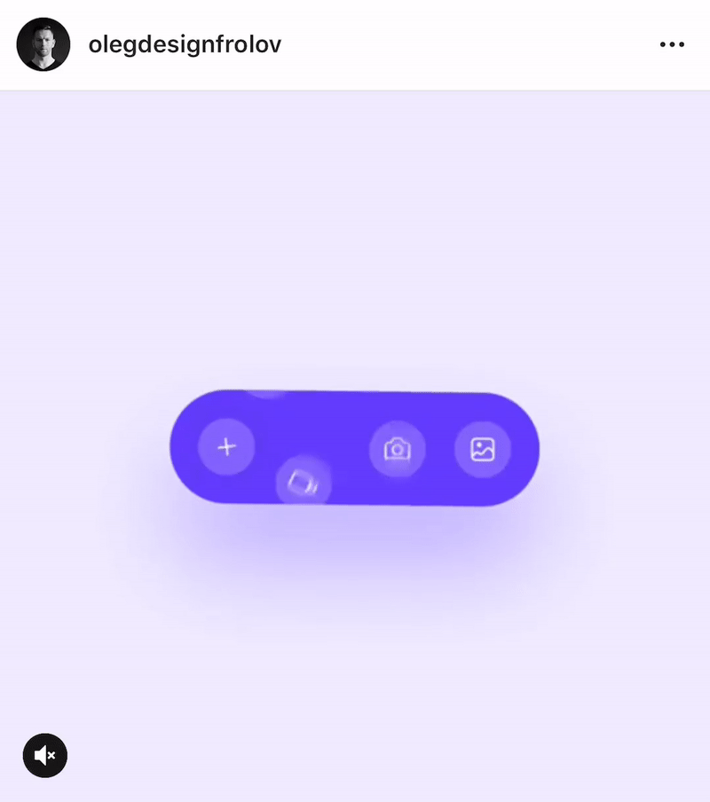

# chat-bar-interaction

I was just checking some Instagram posts and found this interesting chat bar interaction by [Oleg Frolov](https://www.instagram.com/p/Bu3Ek9OheRU/?utm_source=ig_share_sheet&igshid=znkv2bc2rn2m). 

Just wanted to experiment with CSS animations as it's been a while I have tried them.

A quick implementation, feel free to check the author page as it has other beautiful UX designs!

Here is the link to the Instagram post and the author is: [Oleg Frolov](https://www.instagram.com/p/Bu3Ek9OheRU/?utm_source=ig_share_sheet&igshid=znkv2bc2rn2m).

All the icons are by [Sebastien Gabriel](https://www.flaticon.com/authors/sebastien-gabriel) taken from the [flat icon](https://www.flaticon.com/) and changed the background color just to match the theme.

Feel free to advise something, if I can tweak some animations in a better way.

The chat window is "Zoomed to 2", in case you want to use it in normal size please remove "zoom: 2;" in main.css online number: 74.

## Codepen
Check on [CodePen](https://codepen.io/ankursehdev/pen/qvoGqx)

## What it looks like?

## License
License: none (public domain)

@Happy Coding!
